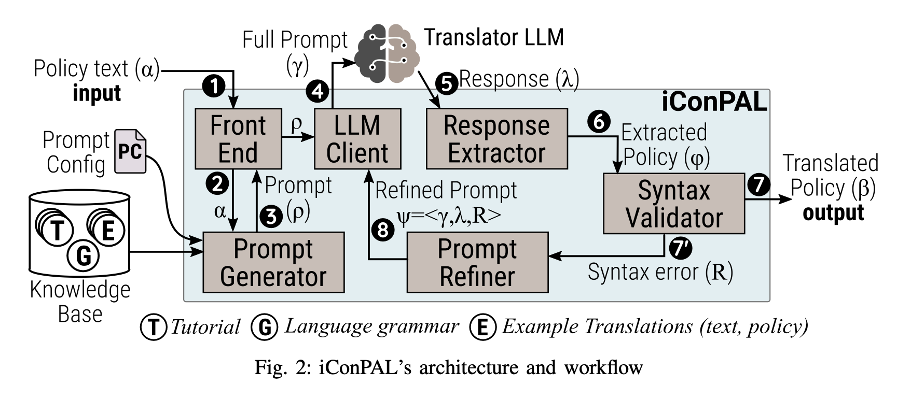

# iConPAL: LLM-guided Policy Authoring Assistant for Configuring IoT Defenses

iConPAL is a fully automated policy authoring assistant for IoT environments. It accepts a policy description in natural language (English) and translates it into a specific formal policy language. iConPAL leverages the capabilities of modern large language models (LLMs), employs prompt engineering to automatically generate few-shot learning prompts for the LLM, and post-processes the LLM’s response to ensure the validity of the translated policy. We implemented a prototype of iConPAL and evaluated it on our curated dataset of 290 policy translation examples. We observed that iConPAL successfully translated 93.61% policies, of which 93.57% were also semantically valid. iConPAL’s high accuracy makes it suitable for assisting ordinary users in drafting policies for smart homes.

# Architecture
 
 

# Setup

Ensure following environment variables in your system.
1. `NAMESPACE`: Docker image and container will contain this value to differentiate from other user's executions.
2. `HUGGING_FACE_HUB_TOKEN`: Hugging face API token.
3. `OPENAI_API_KEY`: OpenAI API key.

Build the docker image for policy-generator.
```bash
make build
```

# Tools

## Policy Validator

You can check if a policy is syntactically valid or not using `policy_validator.py` script.

`policy.iconpal` file contains following policy.

```
If not(not(Away) and not(Vacation) and not(Sleep)) Then DoorLocked

Away = (HomeMode.status == "Away")
Vacation = (Vacation.status == "True")
Sleep = (HomeMode.status == "Sleep")
DoorLocked = (Door.status == "Locked")
```

```
python policy_validator.py -f policy.iconpal

Valid:  (True, '')
```

## Dataset Validity Checker

Use `dataset_validity_checker.py` script to check validity of policy syntax in dataset.

```
python dataset_validity_checker.py
Total:  290
Valid:  290
Invalid:  0
All policies in dataset are syntactically valid
```

## Dataset Categorizer

Use `dataset_categorizer.py` script to categorize the policies in dataset. It uses large language model to categorize the policies.

```
python dataset_categorizer.py --help
usage: Categorize policy dataset [-h] [-m {GPT3_5_Turbo,GPT3_5_Turbo_16k,GPT4_1106_Preview,GPT4,GPT4_32k}] [--dry-run]

options:
  -h, --help            show this help message and exit
  -m {GPT3_5_Turbo,GPT3_5_Turbo_16k,GPT4_1106_Preview,GPT4,GPT4_32k}, --llm {GPT3_5_Turbo,GPT3_5_Turbo_16k,GPT4_1106_Preview,GPT4,GPT4_32k}
                        LLM model
  --dry-run             Dry run mode
```

# Other python scripts

There are some other additional python scripts in the repository.

- `utils.py`: Contains utility functions.
- `token_counter.py`: Counts the number of tokens in a given file or directory.
- `syntax_validity_checker.py`: Checks the syntax validity of the policies in the given result file or directory.
- `semantic_validity_checker.py`: Checks the semantic validity of the policies in the given result file or directory.
- `prompt_templates.py`: Contains the prompt templates for the LLM.
- `experiment_configs.py`: Contains the experiment configurations.
- `auto_semv_val_wrong_counter.py`: Counts the number of policies that are semantically invalid but marked as valid by the LLM.
- `misclassification_by_category.py`: Counts the number of misclassified (by automated semantic validator) policies per category.
- `consistency_measurement.py`: Measures the syntactic and semantic consistency of policy translations across multiple runs.
- `rq*_g.py`: Generates the graphs for the research questions.
- `rq*.py`: Generates the tables for the research questions.

# Dataset

Dataset is stored in `dataset` directory. Description of the files in the dataset directory is described in [Dataset README.md](./dataset/README.md).

# Experiments

Experiment configuration is stored in `experiment_configs.py` file. You can change the configurations in this file.
Each experiment configuration contains following fields:
- `examples`: Examples to be used in the prompt. The value of this field can be `random`, `llm-categorized`, or `human-categorized`. If `random`, then random examples will be chosen from the dataset. If `llm-categorized`, then examples will be chosen from the dataset based on the category predicted by LLM. If `human-categorized`, then examples will be chosen from the dataset based on the category provided by human.
- `tutorial`: Tutorial of the policy language. We have three versions of the tutorial: `policy_tutorial.md` (detailed), `policy_tutorial_simplified.md` (simplified), and `policy_tutorial_summarized.md` (summarized).
- `temperature`: Temperature of the LLM. It is a hyperparameter of the LLM.
- `grammar`: Grammar of the policy.

`policy_translator.py` script is used to run the experiments. Based on the given configuration, it will run the experiments and produce the outputs in `evaluation/<config_name>/output` directory. The debug information will be stored in `evaluation/<config_name>/debug` directory.

The script accepts following arguments.

```
python policy_translator.py --help
usage: Generate policy from text [-h] [-p PERCENTAGE]
                                 [-m {Llama_2_7b,Llama_2_13b,Llama_2_70b_Quant,Llama_2_7b_Chat,Llama_2_13b_Chat,Llama_2_70b_Chat_Quant,CodeLlama_7b,CodeLlama_13b,CodeLlama_34b,CodeLlama_34b_Quant,CodeLlama_7b_Instruct,CodeLlama_13b_Instruct,CodeLlama_34b_Instruct,CodeLlama_34b_Instruct_Quant,StarCoder,Mistral_7b_0_1,Mistral_7b_0_1_Instruct,Yi_6b,Yi_34b,Yi_6b_200k,Yi_34b_200k,Yi_6b_Chat,Yi_34b_Chat,CodeGen25_7b_Multi,GPT4_1106_Preview,GPT4,GPT4_32k,GPT3_5_Turbo,GPT3_5_Turbo_16k}]
                                 [-e ENDPOINT] -c {ablation,tutorial,example-count,example-type,temperature,custom} -r REPEAT_NUMBER [--dry-run] [--override]
                                 [--reprompt-count REPROMPT_COUNT] [-b BASE_DIRECTORY]

options:
  -h, --help            show this help message and exit
  -p PERCENTAGE, --percentage PERCENTAGE
                        Percentage of examples to include for query
  -m {Llama_2_7b,Llama_2_13b,Llama_2_70b_Quant,Llama_2_7b_Chat,Llama_2_13b_Chat,Llama_2_70b_Chat_Quant,CodeLlama_7b,CodeLlama_13b,CodeLlama_34b,CodeLlama_34b_Quant,CodeLlama_7b_Instruct,CodeLlama_13b_Instruct,CodeLlama_34b_Instruct,CodeLlama_34b_Instruct_Quant,StarCoder,Mistral_7b_0_1,Mistral_7b_0_1_Instruct,Yi_6b,Yi_34b,Yi_6b_200k,Yi_34b_200k,Yi_6b_Chat,Yi_34b_Chat,CodeGen25_7b_Multi,GPT4_1106_Preview,GPT4,GPT4_32k,GPT3_5_Turbo,GPT3_5_Turbo_16k}, --llm {Llama_2_7b,Llama_2_13b,Llama_2_70b_Quant,Llama_2_7b_Chat,Llama_2_13b_Chat,Llama_2_70b_Chat_Quant,CodeLlama_7b,CodeLlama_13b,CodeLlama_34b,CodeLlama_34b_Quant,CodeLlama_7b_Instruct,CodeLlama_13b_Instruct,CodeLlama_34b_Instruct,CodeLlama_34b_Instruct_Quant,StarCoder,Mistral_7b_0_1,Mistral_7b_0_1_Instruct,Yi_6b,Yi_34b,Yi_6b_200k,Yi_34b_200k,Yi_6b_Chat,Yi_34b_Chat,CodeGen25_7b_Multi,GPT4_1106_Preview,GPT4,GPT4_32k,GPT3_5_Turbo,GPT3_5_Turbo_16k}
                        LLM model
  -e ENDPOINT, --endpoint ENDPOINT
                        LLM endpoint
  -c {ablation,tutorial,example-count,example-type,temperature,custom}, --config {ablation,tutorial,example-count,example-type,temperature,custom}
                        Experiment config
  -r REPEAT_NUMBER, --repeat-number REPEAT_NUMBER
                        Repeat number
  --dry-run             Don't actually run the translator, just print prompts to console
  --override            Override existing results
  --reprompt-count REPROMPT_COUNT
                        Number of reprompt with error messages
  -b BASE_DIRECTORY, --base-directory BASE_DIRECTORY
                        Base directory
```

We have an LLM gateway server that provides APIs to interact with LLMs. It is available at https://github.com/syne-lab/llm-gateway. You need to run the LLM gateway server as a docker container and use the endpoint in `policy_translator.py` script.
The default endpoint is `http://llm-gateway:31211`.

To run the LLM gateway server, use following command.

```bash
bash run-cpu.sh
```

Following command shows how to run the example-type experiment using `GPT3_5_Turbo` model.

```bash
ARGS="-m GPT3_5_Turbo --config example-type --reprompt-count 0 --repeat-number 1 --dry-run --endpoint http://llm-gateway:31211" make policy-translation
```
Note that `--dry-run` flag is used to run the experiment with dry run mode. It will not actually run the experiment but print the prompts to debug file.

# How to contribute

1. Create a new branch from `main`

```
bash
git checkout main
git checkout -b <your-branch-name>
```

2. Make changes on your branch.

3. Push your branch to remote

```
bash
git push -u origin <your-branch-name>
```

4. Create a merge request.
